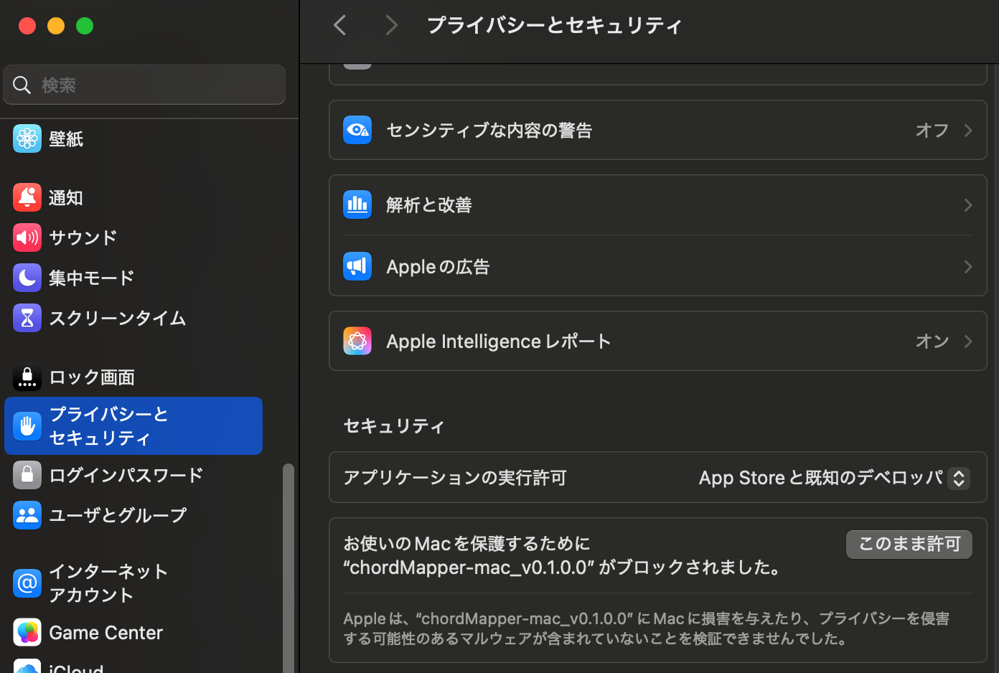

# KANNASHI chordMapper

[](https://github.com/yosukeueda33/chordMapper/actions/workflows/ci.yml)

日本語のReadmeは [こちら](https://github.com/yosukeueda33/chordMapper/blob/main/README_ja.md).

This is a MIDI controller(converter) software. It maps chord notes to every MIDI keyboard keys and the chords changes by time. So, you can improvise on chord without knowing what key is what pitch. Please see the explanation video on YouTube:  
*Under construction. Only Japanese version [here](https://youtu.be/kBlj11tS-cg).

\* The KANNASHI is a Kumamoto prefecture dialect. That means "Not knowing the limits" or "thoughtless".

There are executables for Windows, Mac, Linux. Downloads from Releases page on github.

## Objective
- Amateur musicians who already enjoy playing sequences on instruments like Korg Volca can  easily apply improvisational playing.
- Beginner pianists can easily enjoy improvisational playing and quickly gain a sense of how to play based on music theory.
- You can bring the chord progressions from your favorite songs into a settings file and improvise while maintaining the atmosphere of the song.

## Required knowledge
- Little bit over basic PC skills, such as being able to navigate to the desired folder using the cd command in the command prompt (terminal) window.
- Basic knowledge of chord types. It is sufficient to know that there are major, minor, and seventh chords. There is no need to memorize finger positions.
- Enough musical knowledge to be able to find the chords for a desired song using Google search. For example, for DAFT PUNK's “Something about us” searching for “daftpunk something about us chords” and finding the page [here](https://tabs.ultimate-guitar.com/tab/daft-punk/something-about-us-chords-645697) allows you to determine that the chord progression is “Bflat major7th/Aminor7th/Dminor9th/G7th”.
- Basic knowledge of MIDI. Like assigning sound sources to channels, etc. Knowledge of message contents such as NoteOn is not required.

## Setting example
This tool uses midi piano input and some midi output.
If you don't have anything I will write, never mind. Any midi in-out device is OK as long as it generates or receives usual MIDI signal.

**!!!IMPORTANT!!!**  
Volca fm2 has sequencer function that receives MIDI realtime command. It is not use for this chordMapper. Please Disable it according to the user manual. The realtime commands are for drums.
For Volca fm2, set "MIDI Clock Src" to Internal on parameter settings.


### With MINILAB 3 and Volca fm2 and sample2
This is the connection diagram.  


### With MINILAB 3 and Volca fm2
It is OK to play without drum machine like sample2.
The realtime message will just be ignored.
But it's little bit hard to notice chord change timing without it.
But still you can nitice the timing by keep watching the UI.

## Install
### With binary image.

Please download it from [Releases](https://github.com/yosukeueda33/chordMapper/releases) on the GitHub page.

| OS | Download target for release |
|---|---|
| Windows | chordMapper-win_\[VERSION NAME\].exe |
| Mac | chordMapper-mac_\[VERSION NAME\] |
| Linux | chordMapper-x86_64_\[VERSION NAME\].AppImage |

### From Source (For developers).

#### Linux / Mac

Linux need this library.
```bash
sudo apt install -y libasound2-dev
```

For Mac.
```bash
brew install portmidi
```

Build commands:
```bash
git clone --recursive [REPOSITORY URL]
cd chordMapper
stack build
```

#### Windows

```powershell
git clone --recursive [REPOSITORY URL]
cd chordMapper
stack --stack-yaml .\stack-win.yaml build
```


## Execute

### By binary executable files from Release page.
1. Download something_about_us.dhall from [config](https://github.com/yosukeueda33/chordMapper/tree/main/config).
2. Place the downloaded executable file and something_about_us.dhall in the same folder.
3. In the command prompt (terminal), navigate to the folder from step 2 and execute the following command. A permission window may appear.

By modifying the dhall file, you can specify your preferred chord progression. Refer to [this section](# Chord progression) for details.

Windows:
```bash
chordMapper-win_[VERSION NAME].exe something_about_us.dhall
```

Mac:
```bash
chmod +x chordMapper-mac_\[VERSION NAME\] # Only needed at first time.
./chordMapper-mac_\[VERSION NAME\] ./something_about_us.dhall
```
When you run it for the first time, a pop-up window will appear saying like “...not open...could not verify.”
After clicking the “Finish” button, please allow the following settings.

The next time you run it, a pop-up window will appear asking for permission.
Please allow it in the administrator permission pop-up window.
Now you will finally be able to run it as a command.

Linux:
```bash
chmod +x ./chordMapper-x86_64_[VERSION NAME].AppImage # Only needed at first time.
./chordMapper-x86_64_[VERSION NAME].AppImage ./something_about_us.dhall
```
### On built env from source (For devs).
Linux Mac:
```bash
stack run -- ./config/default.dhall
```

Windows:
```powershell
stack --stack-yaml .\stack-win.yaml run -- .\config\default.dhall
```

## Usage
1. Connect the necessary MIDI input/output devices, or configure software such as DAW, and start up the chordMapper by [this method](# Execute).
2. Select the input/output MIDI device using the arrow keys. Left/Right keys to select the device type: Input, Output, or Special output.
   Up/Down select a device within that type. The highlighted row indicates the selected state.  
  Special output is currently only available on MINILAB3. For now, just select a device with the same name as the Input.  
  
3. Confirm that you are in half-width input mode. Press the Space key to start execution. The chord will be displayed at the top immediately, and when connected to a drum machine, the drum sequence will begin.
  At the bottom of the screen, the chord name (Chord) assigned to the keyboard, the chord index in set (Chord set progress), and how much time remains until the next chord (Chord progress) are displayed.  
  
4. Play the MIDI keyboard specified in step 2 freely to improvise.

## How the chord is mapped. 
Each chord in the chord set is arranged so that the pitch difference from the first chord is small.
Four white keys are grouped into one block and assigned as follows.
- Add passing tones that are not adjacent to the chord tones taken from the root of the four-note chord, one at a time from the bass.
- Set the first black key in the block as the root note.
- Set the second black key as the triad of the chord (CEG for Cmaj).
- The third black key is the rootless four-note chord (EGB for Cmaj)


The starting point for the four-white-key block divisions is MIDI note number `48:C3`. For keyboards with 25 keys, such as the MINILAB3 or MPK mini, simply divide the keys into blocks of four white keys starting from the leftmost key. For keyboards with more than 25 keys, divide the keys into blocks of four starting from `48:C3` and applly same splitting to left and right.

## Configuration by Dhall file
Here is an explanation of each item in the dhall file specified at runtime.
You will mainly change `oneQnSec` and `chordMapSetList`.
Dhall is a text file, so you can edit it with Notepad or similar software.
Be careful not to break the format.

### Main settings

```dhall
oneQnSec = 0.6  -- Seconds per quarter note (24 MIDI clocks). Determines the tempo.
clockOffset = 5 -- Number of clock cycles ahead of chord changes. Creates a time buffer in case of hasty input during chord changes.
recStepNum = 24*4  -- Number of MIDI clocks recorded by the keystroke recording function (MIDI clocks are 24 per quarter note).
```


### Chord progression
You can set chord progressions using `chordMapSetList`.  
The first `chordMapSet` in the example below sets the chord progression for Twilight Surround.  
`durationCnf` sets the assigned time for each chord, and `chordCnf` sets the root note and chord type using `getAbsChord`.
`getAbsChord` expresses the chord type with a space on the right. The first element describes the root note of the chord like “C,” “Fs,” “Bf,” etc., using the uppercase letter of the root note + [s (sharp) or f (flat)], and the second element describes the chord type as “Major7th,” “Minor7th,” “Minor7thFlat5,” etc.  
  
The second `chordMapSet` uses `getDegChord` to represent the chord progression using degree notation.  
`getDegChord “C” “Major” 2` indicates C major II. The first element can be specified in the same way as above, using “C”, ‘Fs’, or “Bf” style.
The second element represents the scale, including the church mode name,  
Major, Minor, Ionian, Dorian, Phrygian, Lydian, Mixolydian, Aeolian, Locrian  
can be specified. The third element is the degree.

```dhall
chordMapSetList = [
  {
    chordMapSet = [ -- Something about us
      {durationCnf = 24*4, chordCnf = getAbsChord "Bf" "Major7th"},
      {durationCnf = 24*4, chordCnf = getAbsChord "A" "Minor7th"},
      {durationCnf = 24*4, chordCnf = getAbsChord "D" "Minor7th"},
      {durationCnf = 24*4, chordCnf = getAbsChord "G" "7th"}
    ]
  },
  {
    chordMapSet = [
      {durationCnf = 24*4, chordCnf = getDegChord "C" "Major" 2},
      {durationCnf = 24*4, chordCnf = getDegChord "C" "Major" 5},
      {durationCnf = 24*4, chordCnf = getDegChord "C" "Major" 1},
      {durationCnf = 24*4, chordCnf = getDegChord "C" "Major" 6}
    ]
  }
]
```

### Special keys.
You can configure touch pads as for switching any chordMapper specific function.
The `aseqdump` command is useful to know what MIDI message generated when target button pressed.

#### Go to next chord map set.
This setting makes touch pad that marked loop on in on Minilab3 as a function that changes chord map set written in `chordMapSetList` configuration. 
```dhall
specialInputs = [
  {controlType = "NextChordMapSet", messageType="NoteOn", channelNum=9, keyNum=39}
]
```

#### Start/Stop/Resume push pattern recording.
This setting makes touch pad that marked Rec to Start recoding,
Play to resume, Stop to stop.
The recording starts at next chord set start after pushing recording.
Playing the recording pattern starts at next chord start.
Pushing stop stops playing push pattern.
Pushing resume restarts playing push pattern.
```dhall
specialInputs = [
    {controlType = "RecStart", messageType="NoteOn", channelNum=9, keyNum=42}
  , {controlType = "RecPlayResume", messageType="NoteOn", channelNum=9, keyNum=41}
  , {controlType = "RecPlayStop", messageType="NoteOn", channelNum=9, keyNum=40}
]
```

