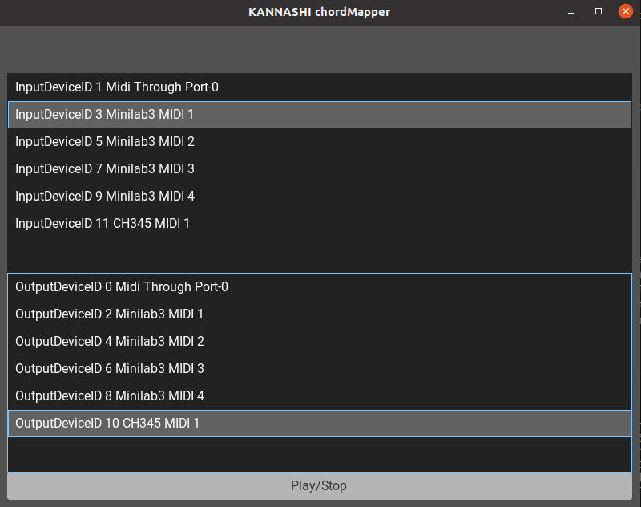

# KANNASHI chordMapper

[](https://github.com/yosukeueda33/chordMapper/actions/workflows/ci.yml)

This is a MIDI controller(converter) software. It maps chord notes to each MIDI keyboard keys dynamically without out-of-chord notes. Sound's wired right? Please see the explanation video on YouTube:  
*Under construction

\* The KANNASHI is a Kumamoto prefecture dialect. That means "Not knowing the limits" or "thoughtless".

## Objective
- Make piano improvisation easy for synth hobbyists.

## Setting example
This tool uses midi piano input and some midi output.
If you don't have anything I will write, never mind. Any midi in-out device is OK as long as it generates or receives usual MIDI signal.

**!!!IMPORTANT!!!**  
Volca fm2 has sequencer function that receives MIDI realtime command. It is not use for this chordMapper. Please Disable it according to the user manual. The realtime commands are for drums.


### With MINILAB 3 and Volca fm2 and sample2
This is the connection diagram.  


### With MINILAB 3 and Volca fm2
It is OK to play without drum machine like sample2.
The realtime message will just be ignored.
But it's little bit hard to notice chord change timing without it.
But still you can nitice the timing by keep watching the UI.

### On Virtual Box
* Under construction.

## Useful commands to check connection.
On Linux, there are useful commands to check midi connection.
This is the command lists up midi interfaces.
Connect Minilab3 or your MIDI input device before execute it.
```bash
$ aseqdump -l
 Port    Client name                      Port name
  0:0    System                           Timer
  0:1    System                           Announce
 14:0    Midi Through                     Midi Through Port-0
 20:0    Minilab3                         Minilab3 MIDI 1
 20:1    Minilab3                         Minilab3 MIDI 2
 20:2    Minilab3                         Minilab3 MIDI 3
 20:3    Minilab3                         Minilab3 MIDI 4
```
You see the first row of the Port column is 20:0.
After hit with -p argument, this command dumps the MIDI input.
Below is the result when I pushed lowest C key on the Minilab3.
```bash
$ aseqdump -p 20:0
Waiting for data. Press Ctrl+C to end.
Source  Event                  Ch  Data
 20:0   System exclusive           F0 00 20 6B 7F 42 02 00 40 63 00 F7
 20:0   Note on                 0, note 48, velocity 83
 20:0   Note off                0, note 48, velocity 0
```

## Setup
### With binary image.
* Under construction.
### From Source.
#### Ubuntu
You need Haskell's `stack` tool to build this tool. I recommend  `ghcup` since it includes `stack` and other useful tools for haskell development.

Install these dev library and tool before build.
```bash
sudo apt install -y libasound2-dev libfreetype-dev libsdl2-dev libglew-dev libgl1-mesa-dev libglfw3-dev

```

Build commands.
```bash
git clone --recurse-submodules [URL OF THIS REPO]
cd THIS_REPO_DIR
wget https://github.com/linuxdeploy/linuxdeploy/releases/download/continuous/linuxdeploy-x86_64.AppImage
chmod +x linuxdeploy-x86_64.AppImage
make build
```

## Getting Started
If you have binary, execute it.
```bash
./chordMapper-x86_64.AppImage
```

If you built from the souce, execute this command in the cloned dir.
```bash
make run
```

If you get this output,
```bash
Setup of the rendering thread failed: Unable to make GL context current
Falling back to rendering in the main thread. The content may not be updated while resizing the window.
```
this may fix the problem.
```bash
__GLX_VENDOR_LIBRARY_NAME=mesa LIBGL_ALWAYS_SOFTWARE=1 ./chordMapper-x86_64.AppImage
__GLX_VENDOR_LIBRARY_NAME=mesa LIBGL_ALWAYS_SOFTWARE=1 make run
```

This is the UI of the chordMapper. Sorry, it's still awful.
Select input and output device that you want to use. 
And then, click `Play/Stop` button.



The chord indicator start showing chords around upper area.  
And if you connected drum machine like volca sample, it will start its sequence. Now it's time to hit the keyboard.


## How the chord is mapped. 
This chord progression example is C Major key II-V-I-VI.
All chords are got voicing as less pitch gap with first chord.
And in each chord time duration, every keys separated by area that one area has series of four white keys. The first black key in the area is mapped as root. White keys in one area is mapped from low key on the chord from low keypad.


## Configuration
Default confuguration is written on config/default.dhall.  
Dhall is configuration file extension that is not widely used. I chose it because it has many strong syntax than other file type.

You can pass path of your config to chordMapper like this.
```shell
make run ARGS="./config/mine.dhall"
```

### Quoter note duration 
This sets one quoter note duration in second. 
One quoter note is for 24 MIDI realtime clock step.
```dhall
oneQnSec = 0.6
```

### Real time clock start offset from chord change.
This sets MIDI realtime clock offset number to make chord change timing earlier than drums.
This makes chord change easier when you rushing than drums.
```dhall
clockOffset = 5
```

### Push pattern recording length.
See Start/Stop/Resume area also.
It sets recording length. The unit is MIDI realtime clock step. 
```dhall
recStepNum = 24*4: Natural -- Shouldn't be changed. It's still buggy.
```

### Enable progress bar on Minilab3 touch pad.
This setting enables progress bar-like lighting on Minilab3's touch pad light.
```dhall
isMinilab3 = True
```
You need to select Minilab3 port on the UI before start looping.

### Chord progression
You can write `direct chord style` with `getAbsChord` function.
You can also write `scale-degree style` with `getDegChord` function.

```dhall
-- other lines...
let root = "C"
let scale = "Major"
-- other lines...
  chordMapSetList = [
      {chordMapSet = [ -- Tasogare Surround
        {durationCnf = 24*4, chordCnf = getAbsChord "E" "Major7th"}
      , {durationCnf = 24*4, chordCnf = getAbsChord "Fs" "7th"}
      , {durationCnf = 24*4, chordCnf = getAbsChord "Ds" "Minor7th"}
      , {durationCnf = 24*4, chordCnf = getAbsChord "Gs" "Minor7th"}
      ]}
  ,   {chordMapSet = [
        {durationCnf = 24*4, chordCnf = getDegChord root scale 2}
      , {durationCnf = 24*4, chordCnf = getDegChord root scale 5}
      , {durationCnf = 24*4, chordCnf = getDegChord root scale 1}
      , {durationCnf = 24*4, chordCnf = getDegChord root scale 6}
      ]}
  ]
-- other lines...
```

The `durationCnf` is steps of MIDI realtime clock. `24*4` means 96 step.

### Special keys.
You can configure unused keys as for switching any chordMapper specific function.
The `aseqdump` command is useful to know what MIDI message generated when target button pressed.

#### Go to next chord map set.
This setting makes touch pad that marked loop on in on Minilab3 as a function that changes chord map set written in `chordMapSetList` configuration. 
```dhall
specialInputs = [
  {controlType = "NextChordMapSet", messageType="NoteOn", channelNum=9, keyNum=39}
]
```

#### Start/Stop/Resume push pattern recording.
This setting makes touch pad that marked Rec to Start recoding,
Play to resume, Stop to stop.
The recording starts at next chord set start after pushing recording.
Playing the recording pattern starts at next chord start.
Pushing stop stops playing push pattern.
Pushing resume restarts playing push pattern.
```dhall
specialInputs = [
    {controlType = "RecStart", messageType="NoteOn", channelNum=9, keyNum=42}
  , {controlType = "RecPlayResume", messageType="NoteOn", channelNum=9, keyNum=41}
  , {controlType = "RecPlayStop", messageType="NoteOn", channelNum=9, keyNum=40}
]
```

## TODO

- [x] Switch between multiple chord map.
- [x] Record pattern.
- [x] Collision note merging.
- [x] Absolute Chord.
- [ ] Modify UI.
- [ ] Wider MIDI key (now only 25-key device works(maybe))
- [ ] Octave change
- [x] Progress bar on Minilab3 touch pads.
- [ ] Send some config written MIDI message at step loop timing.
- [ ] Send predefined MIDI by touch pad.
- [ ] Add offset to chord set's key.