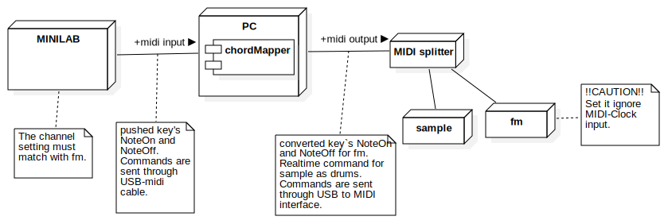
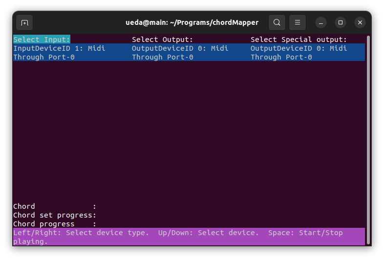
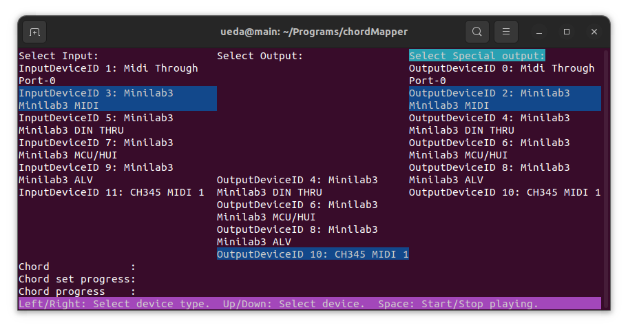
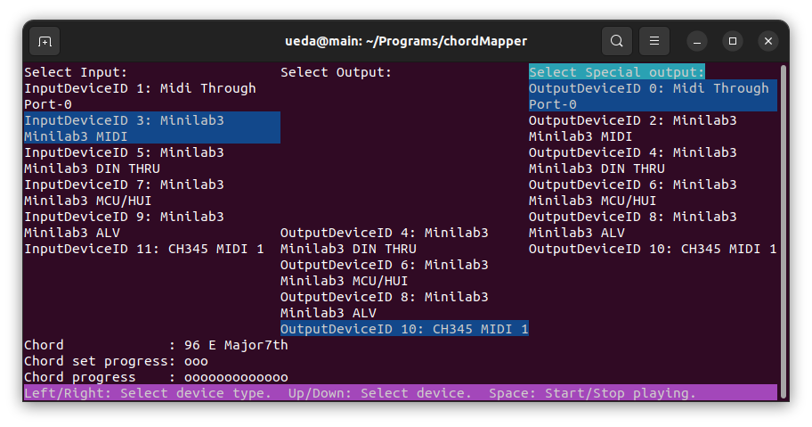
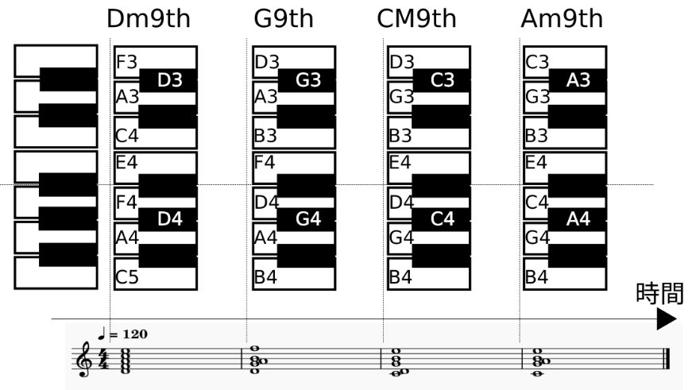

# KANNASHI chordMapper

[](https://github.com/yosukeueda33/chordMapper/actions/workflows/ci.yml)

English readme is [here](https://github.com/yosukeueda33/chordMapper).

**KANNASHI chordMapper** は、ピアノや音楽の知識をそれほど使用せずに感覚のみでの即興演奏を可能とするツールです。
すべての鍵盤入力をコード(和音)構成音に変換する仕組みにより、誰でも音を外さずに即興演奏を楽しめます。 
詳細はYouTube動画（※準備中）をご覧ください。

このツールはWindows,Mac,Linuxなどのデスクトップ環境で動作するMIDIコントローラソフトです。
実行ファイルとして公開をしており、githubページの[Releases](https://github.com/yosukeueda33/chordMapper/releases)から
各OS向けにダウンロード可能です。
使用方法は当Readmeで紹介するバイナリ実行方法をご参照ください。

> ※「KANNASHI（かんなし）」は熊本弁で「限度知らず」「考えなし」を意味します。

## 目的
- すでにKorg Volcaなどでシーケンス演奏を楽しんでいるけど音楽理論を知らない趣味の音楽家が、即興演奏要素を取り入れられる。
- ピアノ初心者が簡単に即興演奏を楽しみ、音楽理論に基づく演奏の感覚を早期に実感できる。
- 好きな楽曲のコード進行を設定ファイルに書き写して曲の雰囲気を保って即興演奏できる。

## 必要な知識
- コマンドプロンプト(ターミナル)画面でcdコマンドで目的のフォルダに到達できる程度のPC操作知識。
- 基本的なコードの種類に関する知識。メジャー、マイナー、セブンスなどが存在するということがわかればOK。指の形を覚えたりなどは不要。
- Google検索で目的の曲のコードが把握できる程度の音楽知識。例えばRIP SLYMEの「黄昏サラウンド」であれば"rip slyme 黄昏サラウンド コード"で検索して見つかった[このページ](https://gakufu.gakki.me/m/index.php?p=DT08370&k=)からコード進行が"Eメジャー7th/F#7h/D#マイナー7th/G#マイナー"であることを読み取れればOK。
- MIDIの基礎知識。音源をチャンネルに割り当てるなど。NoteOnなどメッセージの内容については不要。

## 接続例

入力のためのMIDIキーボードと、出力先としてのMIDI音源が必要です。
MIDIキーボードは[Arturia MINILAB3](https://www.arturia.com/ja/products/hybrid-synths/minilab-3/overview)や
[AKAI MPK mini MK3](http://akai-pro.jp/mpkminimk3/)などの一般的なもので大丈夫です。
MIDI音源は[Korg Volcaシリーズ](https://www.korg-volca.com/)などのハードウェアでも良いですし、
Korg GadgetやAbleton Liveなどのソフト音源でも大丈夫です。


**注意事項**  
MIDIの同期(システムリアルタイム)メッセージを使用します。Volca sampleやVolca drumなどのドラムパート担当機器のシーケンサー機能実行用のメッセージです。
Volca fmなどの非ドラムパート機器ではこれを受信すると不要なシーケンサー機能が実行されてしまうので、これを設定で無効化する必要があります。
VolcaシリーズではグローバルパラメータのMIDI Clock SrcをInternalにする操作がこの無効化に当たります。
ドラムパートを担当する機器は有効状態のままで大丈夫です。

### MINILAB 3 + Volca FM2 + Volca Sample2 の場合



### MINILAB 3 + Volca FM2

Volca Sample2などのドラムパートがなくても動作しますが、コード変更タイミングが演奏中分かりにくくなるため、進行表示している画面行の確認が必要です。
MINILAB3では進行をタッチパッドを光らせて表示するようにしています。

## インストール

### バイナリを使用する場合

githubページの[Releases](https://github.com/yosukeueda33/chordMapper/releases)からダウンロードしてください。
バイナリの実行形式なので、ダウンロードのみで大丈夫です。

| OS | Releaseのダウンロード対象 |
|---|---|
| Windows | chordMapper-win_\[VERSION NAME\].exe |
| Mac | chordMapper-mac_\[VERSION NAME\] |
| Linux | chordMapper-x86_64_\[VERSION NAME\].AppImage |

### ソースからビルドする場合(開発者向け情報)

#### Linux / Mac

Linuxは以下でライブラリインストールが必要。
```bash
sudo apt install -y libasound2-dev
```
Macは以下が必要。
```bash
brew install portmidi
```

以下でビルド。
```bash
git clone --recursive [リポジトリURL]
cd chordMapper
stack build
```

#### Windows

```powershell
git clone --recursive [リポジトリURL]
cd chordMapper
stack --stack-yaml .\stack-win.yaml build
```

## 起動方法

### バイナリ使用時

1. [config](https://github.com/yosukeueda33/chordMapper/tree/main/config)からtasogare_surround.dhallをダウンロードしてください。
2. [インストール方法](#バイナリを使用する場合)でダウンロードしたファイルとtasogare_surround.dhallを同じフォルダに入れてください。
3. コマンドプロンプト(ターミナル)で2のフォルダに移動し以下を実行してください。権利許可のウィンドウが出る場合があります。

コンフィグに使用しているdhallファイルを修正することで使用者の好きなコード進行を指定できます。[この章](#コード進行の定義)を参考にしてください。

Windows:
```bash
.\chordMapper-win_[VERSION NAME].exe .\tasogare_surround.dhall
```

Mac:
```bash
./chordMapper-mac_\[VERSION NAME\] ./tasogare_surround.dhall
```

Linux:
```bash
chmod +x ./chordMapper-x86_64_[VERSION NAME].AppImage
./chordMapper-x86_64_[VERSION NAME].AppImage ./tasogare_surround.dhall
```

実行に成功すると以下画面になります。初回起動時は一旦Escキーで終了させてください。  



### ソースビルド時(開発者向け情報)
Linux Mac:
```bash
stack run -- ./config/default.dhall
```

Windows:
```powershell
stack --stack-yaml .\stack-win.yaml run -- .\config\default.dhall
```

## 使い方
1. 必要なMIDI入出力機器を接続、もしくはDAWなどのソフト設定し[この方法で](#バイナリ使用時)起動。
2. 入出力MIDIデバイスを矢印キーで選択。左右で入力(Input)、出力(Output)、スペシャル出力(Special output)のデバイスタイプ選択。
   上下でそのタイプ内のデバイスを選択。ハイライトされている行が選択状態を意味しています。
  スペシャル出力は現在MINILAB3のみの機能です。とりあえず入力(Input)と同じ名前のデバイスを選択していれば大丈夫です。  
  
3. 半角入力モードであることを確認。Spaceキーで実行開始。直後コードが上部に表示され、ドラムマシン接続時は演奏開始される。
  画面下部にキーボードに割当て中のコード名(Chord)と何番目のコードか(Chord set progress)と、現在のコードからあとどのくらいで次のコードに移るか(Chord progress)が表示される。
  
4. 2で指定したMIDIキーボードを自由に弾いて即興演奏してください。


## キーとピッチ割当てのされ方

コードセット中の各コードは1番目のコードとの音高差が少なくなるように配置されています。
白鍵4つを1ブロックとし以下のように割り当てています。
- 4つの白鍵に四和音のルートを取ったコードトーンを、隣接しない通過音を付加して低音から１つずつ
- ブロック1番目の黒鍵をルート音
- 2番目の黒鍵をコードの三和音(CmajであればCEG)
- 3番目の黒鍵を四和音からルートをとったもの(CmajであればEGB)




白鍵4つのブロック区切りの基点はMIDIノート番号で言う`48:C3`です。MINILAB3やMPK miniなどの25キーのキーボードは最左のキーから右へ白鍵４つずつで区切っていけば良いです。それ以上のキー数があるものは`48:C3`から左右へ4つずつ区切れば良いです。

## dhallファイル設定

実行時に指定するdhallファイル内の各項目について説明します。
主に変更するのは`oneQnSec`と`chordMapSetList`程度です。
dhallはテキストファイルなのでメモ帳などで編集できます。
フォーマットが崩れないように注意してください。


### 主な設定項目

```dhall
oneQnSec = 0.6  -- 4分音符(24MIDIクロック)に対する秒数。テンポを決める。
clockOffset = 5 -- コード切り替えの先行クロック数。コード切り替え時に焦って入力してしまった際の時間余裕を作る。
recStepNum = 24*4  -- 打鍵録音機能の録音MIDIクロック数(MIDIクロックは24個で4分音符)。
```

### コード進行の定義
`chordMapSetList`でコード進行を設定できます。
以下例の1番めの`chordMapSet`は黄昏サラウンドのコード進行を設定しています。
`durationCnf`はコード単体ごとの割当て時間、`chordCnf`は`getAbsChord`でコードのルートとコードの種類を設定しています。
`getAbsChord`右に空白をはさみながらコード種類を表現します。1要素目は"C","Fs","Bf"などのように`ルート音の大文字+[s(シャープ) or f(フラット)]`としてコードのルート音を記述し、2要素目はコードタイプとして"Major7th"、"Minor7th"、"ChMinor7thFlat5"など記述してください。  
  
2番めの`chordMapSet`は`getDegChord`によりディグリー表記でコード進行を表現しています。
`getDegChord "C" "Major" 2`はCメジャーのIIを示しています。1要素目は上記と同様"C","Fs","Bf"での指定ができます。
2要素目はスケールを表しておりチャーチモード名含め、  
Major,Minor,Ionian,Dorian,Phrygian,Lydian,Mixolydian,Aeolian,Locrian  
が記述可能です。3要素目はディグリーです。

```dhall
chordMapSetList = [
  {
    chordMapSet = [
      {durationCnf = 24*4, chordCnf = getAbsChord "E" "Major7th"},
      {durationCnf = 24*4, chordCnf = getAbsChord "Fs" "7th"},
      {durationCnf = 24*4, chordCnf = getAbsChord "Ds" "Minor7th"},
      {durationCnf = 24*4, chordCnf = getAbsChord "Gs" "Minor7th"}
    ]
  },
  {
    chordMapSet = [
      {durationCnf = 24*4, chordCnf = getDegChord "C" "Major" 2},
      {durationCnf = 24*4, chordCnf = getDegChord "C" "Major" 5},
      {durationCnf = 24*4, chordCnf = getDegChord "C" "Major" 1},
      {durationCnf = 24*4, chordCnf = getDegChord "C" "Major" 6}
    ]
  }
]
```


## 特殊キーの設定
MINILAB3などのようにタッチパッドを持っている機器や、外部MIDIボタンを持っている機器があれば、特殊キーを割り当てることで、
打鍵録音の開始/再生停止/再生再開や、コード進行セットの切り替えができます。以下はMINILAB3での設定例です。

### コード進行セット切替

```dhall
specialInputs = [
  {controlType = "NextChordMapSet", messageType="NoteOn", channelNum=9, keyNum=39}
]
```

### 打鍵録音操作
打鍵録音機能は以下の動画をご覧ください。  
*準備中、、、

```dhall
specialInputs = [
  {controlType = "RecStart", messageType="NoteOn", channelNum=9, keyNum=42},
  {controlType = "RecPlayResume", messageType="NoteOn", channelNum=9, keyNum=41},
  {controlType = "RecPlayStop", messageType="NoteOn", channelNum=9, keyNum=40}
]
```

